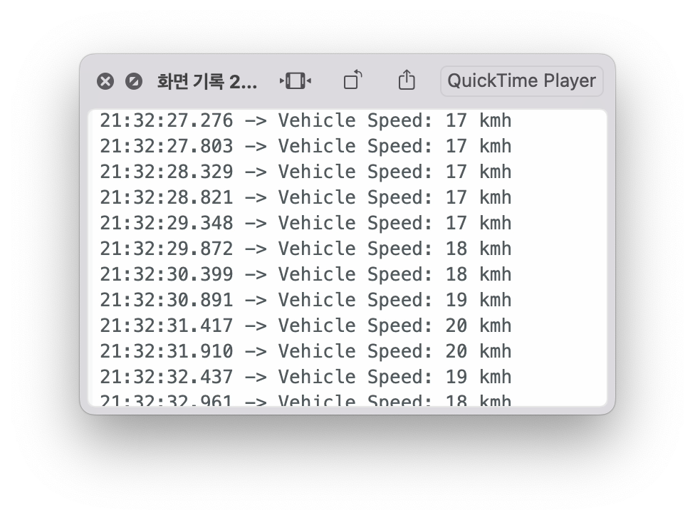

# OBD2_communication_sample
sample code for OBD2 develope board's communication

https://docs.longan-labs.cc/1030003/#pin-out    
follow this document and fix for working

Regardless of the data used, refer to this code when setting up

Confirmed that the code works as shown in the image below

sample video
https://youtu.be/x6waisBggxk

